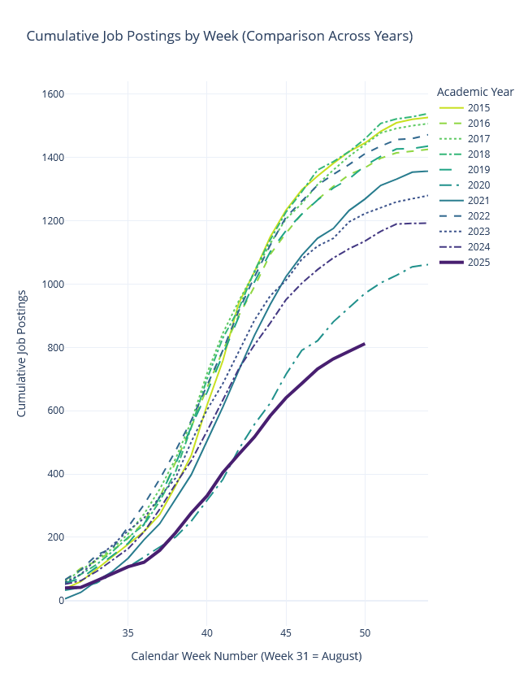
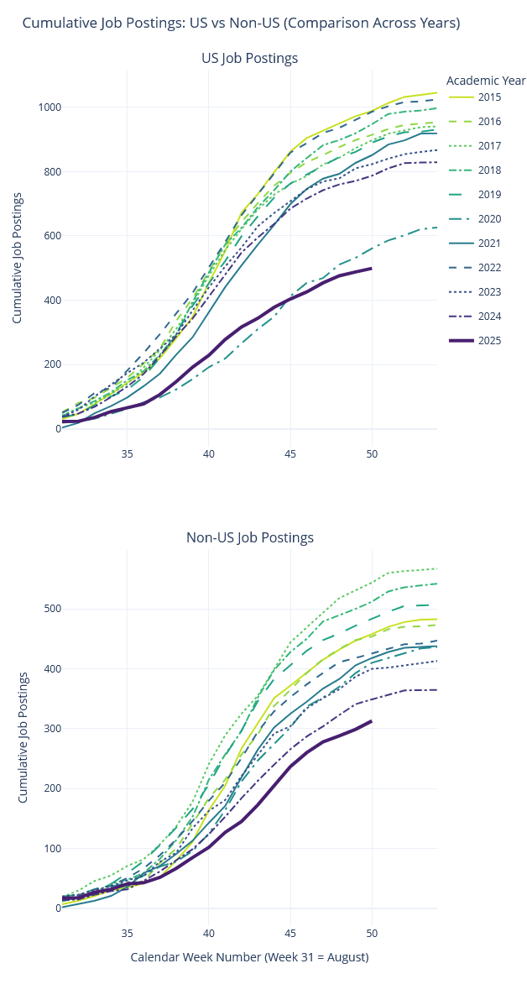

## Job markets, plural

::: {.fragment .semi-fade-out fragment-index="1"}
-   Government jobs
:::

::: {.fragment .semi-fade-out fragment-index="1"}
-   Private sector / Tech / Data Science
:::

::: {.fragment .semi-fade-out fragment-index="1"}
-   Non-academic research (think tanks, IOs, central banks)
:::

::: {.fragment .highlight-red fragment-index="1"}
-   Academic research
:::

## So What is This Job Market?

Standardized hiring system, coordinated around:

::: incremental
-   Timing

-   Applications

-   Staging
:::

## The Job Market Timeline

```{r}
#load ggplot2 and ggthemes libraries
library(ggplot2)
library(ggthemes)

# Force English month names regardless of system locale
invisible(Sys.setlocale("LC_TIME", "C"))

#create data frame with generic dates (year is arbitrary, only months matter)
data <- read.csv(text="event,start,end
                 Job openings,    2025-09-15,2025-12-15
                 Interviews,      2025-12-01,2026-01-31
                 Flyouts,         2026-01-10,2026-03-31
                 Secondary Market,2026-03-15,2026-05-15")

# Convert the start and end columns to Date objects
data$start <- as.Date(data$start)
data$end <- as.Date(data$end)

#create gantt chart that visualizes start and end time for each event
ggplot(data, aes(x=start, xend=end, y=reorder(event, difftime(data$start[1], start)), yend=reorder(event, difftime(data$start[1], start)), color=event)) +
  theme_bw()+ #use ggplot theme with black gridlines and white background
  geom_segment(size=8) + #increase line width of segments in the chart
  scale_color_viridis_d() + #use the viridis color scheme
  scale_x_date(date_breaks = "1 month", date_labels = "%b") + #month names only
  theme(axis.title = element_text(), #adjust axis title font
      legend.position = "none", #suppress the legend
      text = element_text(size = 20), #increase font size
      plot.margin = margin(1, 1, 1, 1, "cm")) + #adjust plot margins
  xlab("") + #suppress the x-axis label
  ylab("") #suppress the y-axis label

```

## I want to go on the market, now what?

::: {style="font-size: 85%;"}
-   By end of September:
    -   Have Job Market Paper ready;
    -   Personal website up and running (GitHub Pages, Quarto, Hugo);
    -   Register on [EconJobMarket.org](https://econjobmarket.org){target="_blank"} and [JOE Network](https://www.aeaweb.org/joe/){target="_blank"};
    -   Ask for reference letters;
-   By end of November:
    -   Have presented your JMP multiple times (internal seminars, nearby departments, conferences)
:::

## Job Openings: where

-   [Econjobmarket](https://econjobmarket.org){target="_blank"} 🌍
-   [Job Openings for Economists (JOE)](https://www.aeaweb.org/joe/listings){target="_blank"} 🌍
-   [Inomics](https://inomics.com/){target="_blank"} 🇪🇺
-   [Academictransfer](https://www.academictransfer.com/en/){target="_blank"} 🇳🇱
-   [jobs.ac.uk](https://www.jobs.ac.uk/search/economics){target="_blank"} 🇬🇧
-   [AEA EconTrack](https://www.aeaweb.org/econtrack){target="_blank"} (track who is interviewing)
-   X / Bluesky / LinkedIn

## Job Openings: when



::: {style="font-size: 60%;"}
*Source: [Paul Goldsmith-Pinkham's JOE Tracker](https://paulgp.com/2025/12/10/quick-update.html){target="_blank"} — data & code on [GitHub](https://github.com/paulgp/joe-tracker){target="_blank"}*
:::

## Recent Trends: A Tighter Market

::: columns
::: {.column width="45%"}

[JOE postings have declined steadily since 2019:]{style="font-size: 70%;"}

::: {style="font-size: 70%;"}
-   Total postings in 2024/25: **~37% below** the 2015-19 average
-   US full-time academic positions fell the most; government hiring dropped sharply
-   Finance and private-sector consulting **held steady**
-   The trend may or may not reverse by the time you go on the market
-   Think broadly from the start: sectors, geographies, institution types
:::

[*Sources: [Goldsmith-Pinkham](https://paulgp.com/2025/11/24/joe-market-update-november.html){target="_blank"}; [Cawley (2025)](https://www.aeaweb.org/articles?id=10.1257/pandp.115.880){target="_blank"}*]{style="font-size: 55%;"}

:::

::: {.column width="55%" style="overflow-y: auto; max-height: 550px;"}

:::
:::

## Job Applications: How many?


*Source: [AEA webinar on job market](https://www.aeaweb.org/joe/communications/video/2021/webinar-part-1){target="_blank"}; see also [Cawley (2025)](https://www.aeaweb.org/articles?id=10.1257/pandp.115.880){target="_blank"} for recent data*

## My Job Market

{.absolute bottom=0 right=40 width="250" height="250"}

```{r}
library(ggplot2)

parts <- c(Ghosted = 90, Interviews = 5, Flyouts = 2, Offers = 3)
total <- sum(parts)
ncols <- 10
nrows <- ceiling(total / ncols)

# build grid data
categories <- rep(names(parts), parts)
df <- data.frame(
  category = factor(categories, levels = names(parts)),
  x = rep(1:ncols, length.out = total),
  y = rep(nrows:1, each = ncols)[1:total]
)

ggplot(df, aes(x = x, y = y, fill = category)) +
  geom_tile(color = "white", linewidth = 0.8) +
  scale_fill_manual(values = c("Ghosted" = "#FFEDA0", "Interviews" = "#FEB24C",
                                "Flyouts" = "#FC4E2A", "Offers" = "#BD0026")) +
  coord_equal() +
  theme_void() +
  theme(legend.position = "right",
        legend.title = element_blank(),
        legend.text = element_text(size = 14))
```

## Interviews {background-color="black" background-image="good-will-hunting-job-interview.jpg" background-opacity="0.4"}

::: {.panel-tabset background-color="black"}
### **Format**

-   Virtual (Zoom). The AEA now recommends this as standard practice.
-   30 minutes.
-   2/3 members of hiring institution.

### **Expect**

-   10/15 minutes pitch of job market paper (JMP);
-   Questions about fit;
-   Questions about your future research avenues;
-   Space for your questions about the Demand Side.

### **Prepare**

-   Short and effective presentation of your JMP;
-   Check profiles of department. Who could you work with? Why?
-   Think about your future research agenda;
-   *Always* ask questions to hiring committee.
:::

## Flyouts {background-color="black" background-image="terminal.webp" background-opacity="0.4"}

::: {.panel-tabset background-color="black"}
### Format

-   1-2 days visit on site (campus);
-   Many 30-minute chats with members of staff;
-   1-1,5 hour seminar of JMP;
-   Lunch and/or dinner with members of staff;
-   Sometimes formal interview.

### Expect

-   Probing questions during seminar;
-   Seminar usually attended by many members of staff with different background;

### Prepare

-   Know ins and outs of your JMP;

-   Answers to most obvious questions:

    ::: {style="font-size: 70%;"}
    -   Your instrument is endogenous
    -   External validity of your experiment
    -   Using DiD? Oh boy...
    :::

-   Work hard on the first 10 minutes of the presentation. Ideally, you need to entice all members of staff.

-   Questions for other members of staff: check what they work on.
:::

## The European Market (EJME)

::: {style="font-size: 75%;"}

**Timing** (fixed through 2028):

-   Virtual interviews: mid-December (Dec 14-17, 2026 for your cohort)
-   Flyouts: January-March (some UK/Belgian depts host multiple candidates on fixed dates)
-   Offers: no deadline earlier than Feb 1; exploding offers (<7 days) are unacceptable

**How it differs from the US market** ([Schindler](https://david-schindler.de/guideejm/){target="_blank"}):

-   European depts have large within-department quality variation across fields. Compare faculty *in your area*, not department rankings.
-   Cover letters matter more. Departments worry you are not genuinely interested. Customize, even if just one or two sentences.
-   Networks matter. Ask your supervisors to contact colleagues at departments you applied to.

**Resources:**

-   [EJME Candidate Directory](https://www.europeanjobmarketofeconomists.org/){target="_blank"} + signaling mechanism (up to 10 signals)
-   [EJME workshops](https://www.europeanjobmarketofeconomists.org/workshops){target="_blank"}: free sessions on interviews, flyouts, negotiating offers
-   [EJME mock interviews](https://www.europeanjobmarketofeconomists.org/){target="_blank"} for candidates whose departments do not offer them
-   [Carlana guide for European candidates (EEA)](https://www.europeanjobmarketofeconomists.org/uploads/Job-Market-Guide-EEA-Website-Michela-Carlana-with-EAYE-Interventions.pdf){target="_blank"}
:::

## The Application Package

::: panel-tabset
### The Job Market Paper

::: {style="font-size: 70%;"}
-   The most important piece of your application;
-   Generally single-authored (increasingly co-authored; if so, clearly signal your contribution);
-   Showcases your best effort;
-   Recommendations:
    -   Work on your introduction again, and again, and again...and then some more.
    -   Ask for feedback on it from anyone you can.
:::

### CV

::: {style="font-size: 70%;"}
-   Recommendations:
    -   Pick a clear, clean template, no matter what format (e.g. .tex/.doc/.rmd).
    -   Ask someone to go through it to check for clarity.
    -   Carefully select the information to include.
    -   Go for relevance, not length.
:::

### Letters of Recommendation

::: {style="font-size: 70%;"}
-   Generally 2/3
-   Your main advisor is expected to be one of them
-   Only academic referees
-   Recommendations:
    -   Give ample time to letter writers
    -   Ask people who know your work well
    -   If you can, get a letter from someone outside U.S.E.
:::

### Cover Letter

::: {style="font-size: 70%;"}
-   1-page letter where you substantiate your interest in the position
-   Arguably **not** the most important piece of the package
-   Recommendations:
    -   Do not repeat the CV
    -   Fine to have a standard template (but please change Institution and recipient's names)
    -   Tailor only when you have something specific to say about that specific application
:::

### Miscellaneous

::: {style="font-size: 70%;"}
-   Course evaluations
-   Research statement
-   Teaching statement
-   Diversity statement (increasingly requested, especially by US institutions)
:::
:::

## Some Tips

::: {style="font-size: 90%;"}
::: incremental
-   Discuss the implications of going on the market with your partner.
-   Seriously think through the implications of going on the market.
-   Talk to recent graduates from U.S.E. who went through the market.
-   Consider a dual strategy: both US/international and European markets (EJME + ASSA cycles overlap but are manageable).
-   The market can be brutal. Look after yourself and let others do the same.
-   The market can also be exhilarating!
-   Do not let it define your worth.
-   Check with us about what we can do for you!
:::
:::

## Useful Resources

::: {style="font-size: 70%;"}
-   [Paul Goldsmith-Pinkham's JOE Tracker (2015-2025)](https://paulgp.com/2025/12/10/quick-update.html){target="_blank"} — the best current data source
-   [Cawley (2025), "Report of the Committee on the Job Market," AEA P&P](https://www.aeaweb.org/articles?id=10.1257/pandp.115.880){target="_blank"}
-   [Cawley's Guide to the Job Market (updated 2025)](https://papers.ssrn.com/sol3/papers.cfm?abstract_id=2883489){target="_blank"}
-   [AEA Guidance on the 2025/26 Job Cycle](https://www.aeaweb.org/news/guidance-25-26-job-market-sept-2-2025){target="_blank"}
-   [AEA EconTrack](https://www.aeaweb.org/econtrack){target="_blank"} — track interview and flyout invitations in real time
-   [EJME 2025/26](https://www.europeanjobmarketofeconomists.org/){target="_blank"} — European Job Market dates and guidelines
-   [EJME workshops](https://www.europeanjobmarketofeconomists.org/workshops){target="_blank"} — free sessions on interviews, flyouts, offers
-   [Carlana guide for European candidates (EEA)](https://www.europeanjobmarketofeconomists.org/uploads/Job-Market-Guide-EEA-Website-Michela-Carlana-with-EAYE-Interventions.pdf){target="_blank"}
-   [EJME Mental Health Resources](https://sites.google.com/view/ejm-mentalhealth/references-and-links?authuser=0){target="_blank"}
-   [David Schindler guide for the European market](https://david-schindler.de/guideejm/){target="_blank"}
-   [Alex Albright's blog on the Job Market](https://thelittledataset.com/2022/03/21/job-mkt/){target="_blank"}
-   [Job Market application tracker](https://github.com/benjaminvatterj/JobMarketTracker){target="_blank"}
-   [USE Job Market tips](https://intranet.uu.nl/en/knowledgebase/an-academic-career-after-use-some-tips){target="_blank"}
:::

